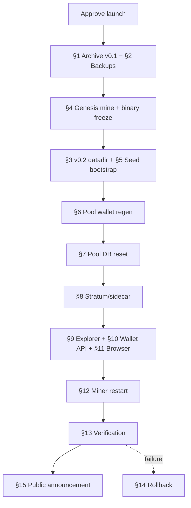

# Byze v0.2.0 relaunch — operator runbook

**Document status:** Prepared — **not executed**  
**Branch:** `release/v0.2.0` (Core: `byze`, Web: `byze-web`, Pool: `byze-pool`)  
**Audience:** Production operators with root/sudo on the seed host  

---

## Hard stops (read before any step)

| Rule | Meaning |
|------|---------|
| **No genesis in this document** | Section 4 describes the procedure only. Do **not** run genesis mining until explicit launch approval. |
| **Do not wipe `~/.byze`** | v0.1 mainnet data is archived in place; copy/move to backup, never delete without a verified tarball. |
| **Do not reset `pool.db` early** | Backup first; reset only during the cutover window (Section 7). |
| **Do not restart production services** | Until the maintenance window is declared open and this runbook is approved. |
| **Validation gate** | All items in `RELAUNCH.md` must remain green on `release/v0.2.0` before cutover. |

**Convention:** Every shell block below is labeled **`NOT RUN YET`**. Treat them as copy-paste templates for the maintenance window, not instructions to run now.

### Reference paths (this host)

| Item | Path |
|------|------|
| v0.1 datadir (archive) | `/home/byze/.byze` |
| v0.2 datadir (planned) | `/home/byze/.byze-v0.2` |
| Current production `byzed` binary | `/home/byze/byze/build/bin/byzed` (currently **v0.2.0**; archive before cutover) |
| v0.2 release binaries | `/home/byze/byze/release/v0.2.0/linux-x86_64/` |
| v0.1 pool wallet (live) | `/home/byze/.byze/poolwallet/` |
| Stratum override | `/etc/systemd/system/byze-stratum-adapter.service.d/override.conf` |
| `byze-rxhash` (stratum) | `/usr/local/bin/byze-rxhash` |
| Pool root | `/home/byze/byze-pool` |
| Pool SQLite | `/home/byze/byze-pool/data/pool.db` |
| Web deploy root | `/home/byze/byze-web` |
| Explorer static | `/var/www/byze-explorer/` |
| Wallet static | `/var/www/wallet/html/` |
| Backup staging (create) | `/home/byze/backups/byze-v0.2-relaunch-YYYYMMDD/` |

### Network (mainnet)

| Service | Port |
|---------|------|
| P2P | `8888` |
| RPC | `8882` |
| Stratum | `3333` (from `.env`) |
| Sidecar | `8085` |
| Pool API | `8086` |
| Explorer API | `3001` |
| Wallet API | `3002` |

Verify live RPC URL in `/home/byze/byze-pool/.env` — `.env.example` shows `8332` but production `byze.conf` uses **`8882`**.

---

## 0. Pre-flight (documentation only)

- [ ] Launch approval recorded (ticket/email/change window).
- [ ] `RELAUNCH.md` validation gate still green.
- [ ] `SECURITY_ADVISORY.md` (BYZE-SA-2026-001) reviewed for public messaging.
- [ ] Maintenance window announced internally.
- [ ] Two operators assigned: **primary** (executes), **secondary** (verifies backups + rollback readiness).
- [ ] `byze` on `release/v0.2.0`: commit this runbook; only `release/v0.2.0/linux-x86_64/` untracked besides docs.
- [ ] `byze-web` on `release/v0.2.0`: working tree clean (or record deployed commit in `${BACKUP_ROOT}`).
- [ ] `byze-pool` on `main` at a known-good rev (record `git rev-parse HEAD` in backup manifest).

---

## 1. Archive v0.1 chain/data safely

**Goal:** Freeze v0.1 mainnet state as a forensic archive. Production v0.2 must use a **separate datadir** (Section 3).

### 1.1 Quiesce writers (maintenance window only)

> **NOT RUN YET**

```bash
# Stop consumers of the v0.1 chain first (order matters)
sudo systemctl stop byze-pool-payout.timer byze-pool-payout.service
sudo systemctl stop byze-stratum-adapter.service byze-sidecar.service
sudo systemctl stop byze-explorer-api.service byze-wallet-api.service
sudo systemctl stop byzed.service

# Confirm daemon stopped
/home/byze/byze/build/bin/byze-cli -datadir=/home/byze/.byze -conf=/home/byze/.byze/byze.conf getblockchaininfo
# Expect: connection error or "daemon not running"
```

### 1.2 Record chain tip (for archive manifest)

> **NOT RUN YET** — run **before** stopping `byzed` if you need live tip:

```bash
export ARCHIVE_DATE="$(date -u +%Y%m%d)"
export BACKUP_ROOT="/home/byze/backups/byze-v0.2-relaunch-${ARCHIVE_DATE}"
mkdir -p "${BACKUP_ROOT}/manifests"

/home/byze/byze/build/bin/byze-cli -datadir=/home/byze/.byze -conf=/home/byze/.byze/byze.conf \
  getblockchaininfo | tee "${BACKUP_ROOT}/manifests/v0.1-chain-tip.json"
```

### 1.3 Archive datadir (copy, do not delete source until verified)

> **NOT RUN YET**

```bash
export ARCHIVE_DATE="$(date -u +%Y%m%d)"
export BACKUP_ROOT="/home/byze/backups/byze-v0.2-relaunch-${ARCHIVE_DATE}"
mkdir -p "${BACKUP_ROOT}"

# Consistent snapshot while byzed is stopped
rsync -aH --info=progress2 \
  /home/byze/.byze/ \
  "${BACKUP_ROOT}/datadir-v0.1/"

# Compressed tarball (verify after create)
tar -C "${BACKUP_ROOT}" -czf "${BACKUP_ROOT}/datadir-v0.1.tar.gz" datadir-v0.1/
sha256sum "${BACKUP_ROOT}/datadir-v0.1.tar.gz" | tee "${BACKUP_ROOT}/datadir-v0.1.tar.gz.sha256"

# Integrity check
tar -tzf "${BACKUP_ROOT}/datadir-v0.1.tar.gz" | head
sha256sum -c "${BACKUP_ROOT}/datadir-v0.1.tar.gz.sha256"
```

### 1.4 Mark archive (leave `~/.byze` untouched on disk)

> **NOT RUN YET**

```bash
cat > "${BACKUP_ROOT}/ARCHIVE_MANIFEST.txt" <<EOF
Byze v0.1 mainnet archive
Archived: $(date -u -Iseconds)
Source: /home/byze/.byze
Purpose: forensic / rollback reference only — NOT for v0.2 production
Security: v0.1 quantum signatures were forgeable (BYZE-SA-2026-001)
EOF

# Optional: read-only marker inside original datadir (does not delete data)
touch /home/byze/.byze/ARCHIVED_V01_DO_NOT_RESUME_FOR_PRODUCTION
```

**Success criteria:** Tarball SHA256 verified; manifest written; `~/.byze` still present and unmodified except optional marker file.

---

## 2. Required backups

Create **`${BACKUP_ROOT}`** before any destructive step. Re-run checksums after each backup.

### 2.1 Full backup script (master)

> **NOT RUN YET**

```bash
export ARCHIVE_DATE="$(date -u +%Y%m%d)"
export BACKUP_ROOT="/home/byze/backups/byze-v0.2-relaunch-${ARCHIVE_DATE}"
mkdir -p "${BACKUP_ROOT}"/{datadir-v0.1,pool,web,systemd,nginx,binaries,manifests}

# --- ~/.byze (if not already archived in §1) ---
rsync -aH /home/byze/.byze/ "${BACKUP_ROOT}/datadir-v0.1/"

# --- pool.db + pool logs/locks ---
install -D /home/byze/byze-pool/data/pool.db "${BACKUP_ROOT}/pool/pool.db"
cp -a /home/byze/byze-pool/data/payout.log "${BACKUP_ROOT}/pool/" 2>/dev/null || true
cp -a /home/byze/byze-pool/data/payout.lock "${BACKUP_ROOT}/pool/" 2>/dev/null || true
cp -a /home/byze/byze-pool/.env "${BACKUP_ROOT}/pool/.env"

# --- explorer (stateless API; backup static deploy + repo pin) ---
rsync -a /var/www/byze-explorer/ "${BACKUP_ROOT}/web/explorer-static/" 2>/dev/null || true
rsync -a /home/byze/byze-web/ \
  --exclude node_modules --exclude '.git' \
  "${BACKUP_ROOT}/web/byze-web-src/"

# Note: explorer-api has no SQLite/cache DB — it proxies RPC only.

# --- pool wallet + any descriptor wallets ---
mkdir -p "${BACKUP_ROOT}/binaries/build-bin-pre-cutover" "${BACKUP_ROOT}/binaries/release-v0.2.0-staged"
rsync -aH /home/byze/.byze/poolwallet/ "${BACKUP_ROOT}/datadir-v0.1/poolwallet/" 2>/dev/null || true
if [ -d /home/byze/.byze/wallets ]; then
  rsync -aH /home/byze/.byze/wallets/ "${BACKUP_ROOT}/datadir-v0.1/wallets/"
fi
find /home/byze/.byze -maxdepth 2 -name 'wallet.dat' -exec cp -a {} "${BACKUP_ROOT}/datadir-v0.1/" \;

# --- nginx ---
sudo cp -a /etc/nginx/sites-available/explorer.byze.org "${BACKUP_ROOT}/nginx/"
sudo cp -a /etc/nginx/sites-available/wallet.byze.org "${BACKUP_ROOT}/nginx/"
sudo cp -a /etc/nginx/sites-available/pool.byze.org "${BACKUP_ROOT}/nginx/" 2>/dev/null || true
sudo nginx -T 2>/dev/null | sudo tee "${BACKUP_ROOT}/nginx/nginx-full-dump.conf" >/dev/null

# --- systemd units ---
for u in byzed byze-sidecar byze-stratum-adapter byze-pool-payout byze-explorer-api byze-wallet-api; do
  sudo cp -a "/etc/systemd/system/${u}.service" "${BACKUP_ROOT}/systemd/" 2>/dev/null || true
done
sudo cp -a /etc/systemd/system/byze-pool-payout.timer "${BACKUP_ROOT}/systemd/" 2>/dev/null || true
sudo cp -a /etc/systemd/system/byze-stratum-adapter.service.d/ "${BACKUP_ROOT}/systemd/" 2>/dev/null || true

# --- old binaries ---
cp -a /home/byze/byze/build/bin/byze* "${BACKUP_ROOT}/binaries/build-bin-pre-cutover/" 2>/dev/null || true
cp -a /home/byze/byze/release/v0.2.0/linux-x86_64/byze* "${BACKUP_ROOT}/binaries/release-v0.2.0-staged/" 2>/dev/null || true
/home/byze/byze/build/bin/byzed --version | tee "${BACKUP_ROOT}/manifests/byzed-version-before.txt" || true

# --- checksum manifest ---
( cd "${BACKUP_ROOT}" && find . -type f ! -name 'SHA256SUMS' -print0 | sort -z | xargs -0 sha256sum ) \
  | tee "${BACKUP_ROOT}/SHA256SUMS"
```

### 2.2 Backup checklist

| Asset | Location | Backed up |
|-------|----------|-----------|
| v0.1 datadir | `~/.byze` | [ ] |
| `pool.db` | `byze-pool/data/pool.db` | [ ] |
| Explorer deploy | `/var/www/byze-explorer/` | [ ] |
| Explorer API source | `byze-web/explorer-api/` | [ ] |
| Wallets | `~/.byze/poolwallet/` (and `wallets/` if present) | [ ] |
| nginx vhosts | `/etc/nginx/sites-available/*byze*` | [ ] |
| systemd units | `/etc/systemd/system/byze*` | [ ] |
| Old binaries | `build/bin/`, staged `release/v0.2.0/` | [ ] |
| Pool `.env` | `byze-pool/.env` | [ ] |

---

## 3. v0.2 datadir layout

v0.2 mainnet runs on a **new** datadir. Never point v0.2 `byzed` at `~/.byze`.

### 3.1 Create layout

> **NOT RUN YET**

```bash
export V02_DATADIR="/home/byze/.byze-v0.2"
mkdir -p "${V02_DATADIR}"

cat > "${V02_DATADIR}/byze.conf" <<'EOF'
# Byze v0.2.0 mainnet — seed node
server=1
listen=1
daemon=1

port=8888
rpcport=8882
rpcbind=127.0.0.1
rpcallowip=127.0.0.1

# SET BEFORE CUTOVER — rotate from v0.1 credentials
rpcuser=REPLACE_ME
rpcpassword=REPLACE_ME_LONG_RANDOM

txindex=1
dbcache=512
maxconnections=64
par=2

addresstype=bech32m
changetype=bech32m
fallbackfee=0.001
wallet=poolwallet

# Seed: no v0.1 peers
# addnode=<peer2>:8888

# Optional DNS seeds after publish:
# dnsseed=1
EOF

chmod 600 "${V02_DATADIR}/byze.conf"
```

### 3.2 Expected directory tree (after first start)

```
/home/byze/.byze-v0.2/
├── byze.conf
├── blocks/           # block files + indexes
├── chainstate/       # UTXO set
├── wallets/          # descriptor wallets (poolwallet created in §6)
│   └── poolwallet/
├── debug.log
├── peers.dat
├── settings.json
└── .lock
```

### 3.3 systemd datadir migration (planned)

> **NOT RUN YET** — edit unit only during cutover:

```bash
# Backup unit first (see §2)
sudo cp /etc/systemd/system/byzed.service /etc/systemd/system/byzed.service.v0.1.bak

# Point ExecStart/ExecStop at v0.2 binary + new datadir, e.g.:
# ExecStart=/home/byze/byze/release/v0.2.0/linux-x86_64/byzed \
#   -datadir=/home/byze/.byze-v0.2 -conf=/home/byze/.byze-v0.2/byze.conf -daemon
# ExecStop=.../byze-cli -datadir=/home/byze/.byze-v0.2 -conf=... stop

sudo systemctl daemon-reload
```

Update `byze-pool/.env`, `byze-web` RPC env (if any), and explorer/wallet API to use the **same** RPC user/password and port `8882` against the v0.2 datadir.

### 3.4 Point explorer/wallet APIs at v0.2 datadir

`byze-web/shared/index.js` defaults to `BYZE_CONF=/home/byze/.byze/byze.conf`. After cutover, set one of:

- `BYZE_CONF=/home/byze/.byze-v0.2/byze.conf` in `byze-explorer-api.service` and `byze-wallet-api.service`, or
- `RPC_HOST` / `RPC_PORT` / `RPC_USER` / `RPC_PASSWORD` in `/home/byze/byze-web/.env`

Then `sudo systemctl daemon-reload` and restart `byze-explorer-api` / `byze-wallet-api`.

---

## 4. New genesis procedure

**Gate:** Explicit launch approval + v0.2 binaries built from commits that include the final genesis constants.

v0.2 is a **new chain**. Genesis must be mined with **RandomX** (not SHA256d). The v0.1 mainnet genesis in `chainparams.cpp` (`00000a6ff6ac3c6549d30a1931c8ff1fc98be705c7802164d7fb61b2bec85070`) must **not** be reused for the relaunch if the goal is a distinct v0.2 network identity — use a new timestamp message and mine a new nonce.

### 4.1 Choose genesis parameters

Record in `${BACKUP_ROOT}/manifests/genesis-params.txt`:

- **Timestamp string** (e.g. `Byze v0.2.0 quantum-safe relaunch - 2026-06-15 UTC`)
- **`nTime`** (Unix seconds, consistent with message)
- **`nBits`** — default `0x1e0ffff0` unless difficulty policy changes
- **Reward** — `50 * COIN`
- **Coinbase pubkey** — must match `CreateByzeGenesisBlock()` output script in `src/kernel/chainparams.cpp`

### 4.2 Build genesis tools

> **NOT RUN YET**

```bash
cd /home/byze/byze
git checkout release/v0.2.0
git pull --ff-only

cmake -B build -DCMAKE_BUILD_TYPE=Release
cmake --build build --target mine-genesis verify-genesis -j"$(nproc)"
```

### 4.3 Mine genesis (long-running)

> **NOT RUN YET** — requires approval; may take minutes to hours:

```bash
cd /home/byze/byze
# Edit contrib/devtools/mine-genesis.cpp pszTimestamp to match relaunch message FIRST, rebuild mine-genesis.

./build/bin/mine-genesis -time "$(date -u +%s)" -bits 1e0ffff0 -reward 50 \
  | tee /home/byze/backups/genesis-mine-$(date -u +%Y%m%d).log
```

Capture output: **`nNonce`**, **block hash**, **merkle root**.

### 4.4 Patch `chainparams.cpp` and rebuild release

> **NOT RUN YET**

```bash
# Update src/kernel/chainparams.cpp mainnet section, e.g.:
#   genesis = CreateByzeGenesisBlock(<nTime>, <nNonce>, 0x1e0ffff0, 1, 50 * COIN);
#   assert(consensus.hashGenesisBlock == uint256{"<mined hash>"});
#   assert(genesis.hashMerkleRoot == uint256{"<merkle root>"});
# Update pszTimestamp inside CreateByzeGenesisBlock() if changed.

cmake --build build -j"$(nproc)"
./build/bin/verify-genesis
./build/bin/byzed --version   # must show v0.2.0

# Re-stage release binaries after genesis commit is frozen
cp -a build/bin/byzed build/bin/byze-cli build/bin/byze-wallet build/bin/byze-tx build/bin/byze-util \
  release/v0.2.0/linux-x86_64/
cd release/v0.2.0/linux-x86_64 && sha256sum byze* > SHA256SUMS
```

### 4.5 Genesis sign-off

- [ ] `verify-genesis` prints matching hash/merkle
- [ ] Genesis commit tagged (`v0.2.0-genesis` or release tag)
- [ ] `SHA256SUMS` published for binaries **built with that commit**
- [ ] No operator has started a public datadir with different genesis constants

---

## 5. Seed node bootstrap

First production node on the v0.2 chain. Other peers add `addnode` to this host.

### 5.1 Install v0.2 binary and start fresh chain

> **NOT RUN YET**

```bash
export V02_DATADIR="/home/byze/.byze-v0.2"
export BYZE_BIN="/home/byze/byze/release/v0.2.0/linux-x86_64"

# First start — creates genesis from compiled chainparams
"${BYZE_BIN}/byzed" -datadir="${V02_DATADIR}" -conf="${V02_DATADIR}/byze.conf" -daemon

sleep 5
"${BYZE_BIN}/byze-cli" -datadir="${V02_DATADIR}" -conf="${V02_DATADIR}/byze.conf" getblockchaininfo
# Expect: blocks=0, headers=0, chain=main, bestblockhash=<genesis hash>
```

### 5.2 Mine block 1 (seed hashrate)

Quantum block signatures apply from the first post-genesis block. Use v0.2 RPC:

> **NOT RUN YET**

```bash
export CLI="${BYZE_BIN}/byze-cli -datadir=${V02_DATADIR} -conf=${V02_DATADIR}/byze.conf"

${CLI} createwallet "seed" false false "" false true false 2>/dev/null || true
ADDR="$(${CLI} -rpcwallet=seed getnewaddress "" "bech32m")"
${CLI} -rpcwallet=seed generatetoaddress 1 "${ADDR}"
${CLI} getblockchaininfo
# Expect: blocks>=1
```

### 5.3 Enable production systemd

> **NOT RUN YET** — after `byzed.service` updated (§3.3):

```bash
sudo systemctl enable --now byzed.service
sudo systemctl status byzed.service --no-pager
${CLI} getnetworkinfo
```

### 5.4 Peer bootstrap (after additional nodes exist)

> **NOT RUN YET**

```bash
# On seed: allow known peers
${CLI} addnode "<peer-host-or-ip>:8888" "add"

# On peer nodes' byze.conf:
# addnode=<seed-public-ip>:8888
```

Document seed public IP/DNS in the launch announcement.

---

## 6. Pool wallet regeneration

v0.1 `poolwallet` keys use wallet format v1/v2 and **forgeable** quantum semantics. Create a new descriptor wallet on the **v0.2 datadir**.

### 6.1 Prerequisites

- `byzed` running on `${V02_DATADIR}` with v0.2 binary
- Pool services **stopped** (§1.1)

### 6.2 Create `poolwallet`

> **NOT RUN YET**

```bash
export V02_DATADIR="/home/byze/.byze-v0.2"
export CLI="/home/byze/byze/release/v0.2.0/linux-x86_64/byze-cli -datadir=${V02_DATADIR} -conf=${V02_DATADIR}/byze.conf"

# Ensure no legacy poolwallet loaded
${CLI} unloadwallet "poolwallet" 2>/dev/null || true

# Remove only on v0.2 datadir — NOT ~/.byze (wallet dir varies until wallets/ exists)
rm -rf "${V02_DATADIR}/wallets/poolwallet" "${V02_DATADIR}/poolwallet"

${CLI} createwallet "poolwallet" false false "" false true true
${CLI} -rpcwallet=poolwallet getwalletinfo
# Expect: quantum_can_sign=true after encryption unlocked (if used)

FEE_ADDR="$(${CLI} -rpcwallet=poolwallet getnewaddress "pool-fee" "bech32m")"
echo "New POOL_FEE_WALLET=${FEE_ADDR}"
```

### 6.3 Update pool environment

> **NOT RUN YET**

```bash
# Edit /home/byze/byze-pool/.env
#   BYZE_RPC_URL=http://127.0.0.1:8882
#   BYZE_RPC_USER / BYZE_RPC_PASSWORD → match ${V02_DATADIR}/byze.conf
#   BYZE_RPC_WALLET=poolwallet
#   POOL_FEE_WALLET=<FEE_ADDR from above>
# Rotate SIDECAR_API_KEY and POOL_API_KEY if they were exposed on v0.1 infra.
```

### 6.4 Verify pool wallet can sign (before stratum)

> **NOT RUN YET**

```bash
cd /home/byze/byze-pool
set -a && source .env && set +a
./.venv/bin/python3 scripts/pool-wallet-liquidity.py
${CLI} -rpcwallet=poolwallet getwalletinfo | grep quantum
```

---

## 7. Pool DB reset

v0.1 share accounting, balances, and payout history are **invalid** on the new chain. Reset SQLite after backup (§2).

### 7.1 Stop pool writers

> **NOT RUN YET**

```bash
sudo systemctl stop byze-pool-payout.timer byze-pool-payout.service
sudo systemctl stop byze-stratum-adapter.service byze-sidecar.service
```

### 7.2 Backup and reset

> **NOT RUN YET**

```bash
: "${BACKUP_ROOT:?Set BACKUP_ROOT from §1/§2 first}"
mkdir -p "${BACKUP_ROOT}/pool"
export POOL_DB="/home/byze/byze-pool/data/pool.db"
# pool.db can be multi-GB; verify cp succeeds before mv
cp -a "${POOL_DB}" "${BACKUP_ROOT}/pool/pool.db.pre-reset-$(date -u +%Y%m%dT%H%M%SZ)"

mv "${POOL_DB}" "${POOL_DB}.v0.1.archived"
# Schema is recreated on next adapter start via PoolDatabase._init_schema()
```

### 7.3 Reset hashrate epoch (after fresh DB exists)

> **NOT RUN YET** — run **after** stratum has started at least once (creates new `pool.db`):

```bash
cd /home/byze/byze-pool
export POOL_SQLITE_PATH=/home/byze/byze-pool/data/pool.db
./.venv/bin/python3 scripts/pool-reset-hashrate-metrics.py --db "${POOL_SQLITE_PATH}"
# Sets POOL_HASHRATE_STATS_SINCE in DB meta — 1h/24h windows start clean
```

**Note:** `pool-reset-hashrate-metrics.py` alone does **not** wipe shares; use §7.2 for full accounting reset.

---

## 8. Stratum / sidecar deployment

Deploy pool stack against v0.2 RPC (`signpoolblock` + `submitblock` path).

### 8.1 Install / refresh Python venv

> **NOT RUN YET**

```bash
cd /home/byze/byze-pool
git checkout main
git pull --ff-only
git rev-parse HEAD | tee "${BACKUP_ROOT:-/tmp}/manifests/byze-pool-git-rev.txt"
./scripts/setup-venv.sh
```

### 8.2 Install systemd units

> **NOT RUN YET**

```bash
cd /home/byze/byze-pool
sudo ./scripts/install-sidecar-systemd.sh
sudo ./scripts/install-stratum-adapter-systemd.sh
sudo systemctl daemon-reload
```

### 8.3 Start and verify

> **NOT RUN YET**

```bash
sudo systemctl start byze-sidecar.service byze-stratum-adapter.service
sudo systemctl enable byze-sidecar.service byze-stratum-adapter.service

./scripts/healthcheck.sh
./scripts/healthcheck-stratum-adapter.sh

# Sidecar should report signpoolblock=true against v0.2 byzed
curl -fsS http://127.0.0.1:8085/healthz | python3 -m json.tool
```

### 8.4 Enable payouts (last pool step)

> **NOT RUN YET**

```bash
sudo systemctl enable --now byze-pool-payout.timer
sudo systemctl start byze-pool-payout.service
```

---

## 9. Explorer redeploy

Explorer API is a **read-only RPC proxy** — no separate DB. Redeploy after seed `byzed` is on v0.2.

### 9.1 Deploy web + API

> **NOT RUN YET**

```bash
cd /home/byze/byze-web
git checkout release/v0.2.0
git pull --ff-only
npm install
npm run test:wallet-crypto

# Required after v0.2 datadir (see §3.4)
export BYZE_CONF=/home/byze/.byze-v0.2/byze.conf

./scripts/deploy.sh
```

### 9.2 Verify explorer

> **NOT RUN YET**

```bash
curl -fsS http://127.0.0.1:3001/health
curl -fsS http://127.0.0.1:3001/status | python3 -m json.tool
# Expect: blocks>=0, version string contains v0.2.0

curl -fsSI https://explorer.byze.org/ | head -5
```

---

## 10. Wallet API redeploy

Deployed by `scripts/deploy.sh` (systemd `byze-wallet-api.service`). Confirm watch-only mode.

> **NOT RUN YET**

```bash
curl -fsS http://127.0.0.1:3002/capabilities | python3 -m json.tool
# Expect: mode=watch-only, signing=false, mnemonicInBrowser=false

sudo systemctl status byze-wallet-api.service --no-pager
```

---

## 11. Browser wallet (watch-only) deploy

Included in `deploy.sh` → `/var/www/wallet/html/`. Users must **not** expect v0.1 mnemonics to work.

### 11.1 Build and deploy frontend only (if needed)

> **NOT RUN YET**

```bash
cd /home/byze/byze-web
npm run build:wallet-crypto
bash scripts/bundle-wallet-app.sh
sudo bash scripts/deploy-wallet-frontend.sh
sudo nginx -t && sudo systemctl reload nginx
```

### 11.2 HMAC removal smoke (production host)

> **NOT RUN YET**

```bash
cd /home/byze/byze-web
grep -RInE 'hmacKeccak|signTransaction|byze_quantum_hd_v1' \
  wallet-web/assets/byze-crypto wallet-web/assets/wallet-app.bundle.js wallet-api/server.js \
  && echo "FAIL: signing artifacts found" && exit 1 || echo "OK: watch-only tree clean"

wc -c wallet-web/assets/wallet-app.bundle.js
# Expect ~80–120 KB (not v0.1 500KB+ signing bundle)
```

### 11.3 UI acceptance

- [ ] `https://wallet.byze.org` loads
- [ ] `#/add` works; `#/create`, `#/restore`, `#/send` routes absent or redirect
- [ ] `#/broadcast` accepts pasted signed hex from Core
- [ ] Legacy `localStorage` shows migration message (v3 watch-only)

---

## 12. Miner restart procedure

Communicate to miners **after** stratum is healthy on v0.2.

### 12.1 Operator verification (before announcing)

> **NOT RUN YET**

```bash
# Stratum listening
ss -lntp | grep ':3333' || true

# Test authorize + subscribe (replace host/user)
# miner wallet: byz1... worker: rig1
printf '{"id":1,"method":"mining.subscribe","params":[]}\n' | nc -w 3 127.0.0.1 3333
```

### 12.2 Miner configuration (publish to miners)

| Setting | Value |
|---------|-------|
| Stratum URL | `stratum+tcp://pool.byze.org:3333` (or your public host) |
| Username | `<byz1 payout address>` |
| Worker | `<optional worker name>` |
| Algorithm | RandomX (Byze) |
| **Required** | Miner build compatible with v0.2 block/header format |

### 12.3 Miner restart order

1. Pool confirms block template + `signpoolblock` path (§8.3).
2. Publish maintenance complete notice.
3. Miners: stop → update binary/config if needed → point at pool host → start.
4. Monitor first shares in pool API:

> **NOT RUN YET**

```bash
curl -fsS http://127.0.0.1:8086/api/pool/stats | python3 -m json.tool
```

---

## 13. Verification checklist

Run after full cutover. All commands **`NOT RUN YET`** until launch.

### 13.1 Core / chain

```bash
export CLI="/home/byze/byze/release/v0.2.0/linux-x86_64/byze-cli -datadir=/home/byze/.byze-v0.2 -conf=/home/byze/.byze-v0.2/byze.conf"

${CLI} getnetworkinfo | grep -E 'version|subversion'
${CLI} getblockchaininfo
${CLI} getblockhash 0    # must match published v0.2 genesis
${CLI} help signpoolblock
```

- [ ] `byzed` version `v0.2.0`
- [ ] Genesis hash matches published constants
- [ ] Blocks advance under load
- [ ] `submitblock` rejects v0.1-sized quantum witnesses (spot-check on regtest before prod)

### 13.2 Pool

```bash
curl -fsS http://127.0.0.1:8085/healthz
curl -fsS http://127.0.0.1:8086/api/pool/stats
cd /home/byze/byze-pool && ./scripts/verify-pool-public.sh
```

- [ ] Sidecar reports `signpoolblock: true`
- [ ] Shares accepted; `pool.db` fresh round ID
- [ ] `poolwallet` `quantum_can_sign=true`
- [ ] Payout timer enabled (payouts may wait for maturity)

### 13.3 Web

```bash
curl -fsS http://127.0.0.1:3001/status
curl -fsS http://127.0.0.1:3002/capabilities
```

- [ ] Explorer shows height ≥ 1
- [ ] Wallet API watch-only
- [ ] HTTPS vhosts 200 OK

### 13.4 Security / hygiene

- [ ] RPC passwords rotated from v0.1
- [ ] `SIDECAR_API_KEY` / `POOL_API_KEY` rotated
- [ ] `~/.byze` archived, not used by running `byzed`
- [ ] `SECURITY_ADVISORY.md` published

---

## 14. Rollback checklist

Use only if v0.2 cutover fails **before** public miners depend on the new chain, or if explicitly approved to resume v0.1 archive (discouraged — see advisory).

### 14.1 Stop v0.2 stack

> **NOT RUN YET**

```bash
sudo systemctl stop byze-pool-payout.timer byze-stratum-adapter.service byze-sidecar.service
sudo systemctl stop byze-explorer-api.service byze-wallet-api.service
sudo systemctl stop byzed.service
```

### 14.2 Restore v0.1 `byzed` + datadir

> **NOT RUN YET**

```bash
test -f /etc/systemd/system/byzed.service.v0.1.bak || \
  { echo "Missing byzed.service.v0.1.bak — restore from ${BACKUP_ROOT}/systemd/"; exit 1; }
sudo cp /etc/systemd/system/byzed.service.v0.1.bak /etc/systemd/system/byzed.service
sudo systemctl daemon-reload

# Ensure datadir is archive copy or original ~/.byze (untouched)
sudo systemctl start byzed.service
/home/byze/byze/build/bin/byze-cli -datadir=/home/byze/.byze -conf=/home/byze/.byze/byze.conf getblockchaininfo
```

### 14.3 Restore pool DB and `.env`

> **NOT RUN YET**

```bash
export BACKUP_ROOT="/home/byze/backups/byze-v0.2-relaunch-YYYYMMDD"  # use actual cutover date
cp -a "${BACKUP_ROOT}/pool/pool.db" /home/byze/byze-pool/data/pool.db
cp -a "${BACKUP_ROOT}/pool/.env" /home/byze/byze-pool/.env
sudo systemctl start byze-sidecar.service byze-stratum-adapter.service
```

### 14.4 Restore web (if v0.2 deploy broke sites)

> **NOT RUN YET**

```bash
sudo rsync -a "${BACKUP_ROOT}/web/explorer-static/" /var/www/byze-explorer/
cd /home/byze/byze-web && git checkout main  # or pre-relaunch tag
./scripts/deploy.sh
```

### 14.5 Rollback decision log

| Question | Action |
|----------|--------|
| v0.2 blocks mined publicly? | Rollback to v0.1 **orphans** v0.2 work — prefer forward-fix |
| `pool.db` reset already? | Restore from `${BACKUP_ROOT}/pool/pool.db` |
| Genesis published? | Do not change `chainparams` on running network without full redeploy |

**Warning:** v0.1 chain remains cryptographically broken for quantum claims (BYZE-SA-2026-001). Rollback is for operational continuity only.

---

## 15. Public announcement checklist

Prepare materials **before** maintenance; publish **after** §13 passes.

### 15.1 Technical content

- [ ] **Security advisory** link: `SECURITY_ADVISORY.md` (BYZE-SA-2026-001)
- [ ] **v0.2.0 release notes** — liboqs XMSS/SPHINCS+, wallet format v3, chain reset
- [ ] **New genesis hash** and launch timestamp (UTC)
- [ ] **Seed node** / `addnode` instructions (`<seed>:8888`)
- [ ] **Pool stratum** URL and port
- [ ] **Binary downloads** + `SHA256SUMS` for Linux (and Guix builds when ready)
- [ ] **Browser wallet:** watch-only only; Core required for keys/signing
- [ ] **v0.1 archive statement:** balances on old chain are not migrated; no guarantee of spend authority

### 15.2 User actions

- [ ] Upgrade to `byze v0.2.0` from `release/v0.2.0`
- [ ] Create **new** Core wallet; do not rely on v0.1 browser mnemonics
- [ ] Miners: update pool config / miner software per §12
- [ ] Rotate any credentials shared with v0.1 infrastructure

### 15.3 Channels

- [ ] Website / blog post
- [ ] Discord / Telegram / mailing list
- [ ] GitHub release with tagged binaries
- [ ] Explorer banner: “v0.2.0 mainnet — new chain”
- [ ] Pool status page

### 15.4 Sample announcement snippet (draft)

> Byze **v0.2.0** mainnet is live on a **new chain** with real liboqs quantum signatures. v0.1 mainnet (through height ~3,751) is **archived** due to a critical signature flaw (BYZE-SA-2026-001). Install v0.2.0 binaries, sync from genesis, use Core for wallets, and point miners to `stratum+tcp://pool.byze.org:3333`. The browser wallet is **watch-only**.

---

## Execution order summary



---

## Document control

| Field | Value |
|-------|-------|
| Version | 1.1 (server review fixes) |
| Created | 2026-06-15 |
| Related | `RELAUNCH.md`, `SECURITY_ADVISORY.md`, `GENESIS_AND_NETWORK.md` |
| Next action | Launch approval → execute sections in order during maintenance window |

*This runbook was prepared without generating genesis, wiping datadirs, resetting pool DB, or restarting production services.*
